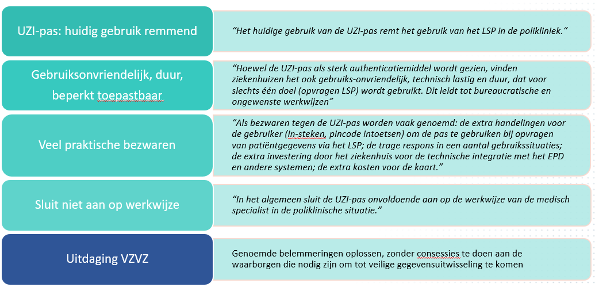

# Bedrijfsarchitectuur

## Inleiding

Met de groeiende digitalisering van gegevensuitwisseling in de zorgsector wordt de noodzaak voor veilige en betrouwbare identificatie en authenticatie van zorgprofessionals steeds belangrijker. De huidige UZI (Unieke Zorgverlener Identificatie) middelen, zoals de UZI-pas, voldoen echter niet altijd aan de vereisten van moderne toepassingen en worden vaak als ontoereikend ervaren.

De UZI-pas wordt uitgegeven door het CIBG, een zelfstandig bestuursorgaan van Ministerie van VWS en wordt veel gebruikt om lokaal in te loggen op zorgapplicaties om de verplichte twee-factor authenticatie vanuit de NEN-7510 te realiseren.&#x20;

VZVZ maakt zich sterk voor veilige en betrouwbare uitwisseling van medische gegevens tussen zorgprofessionals en behartigt de belangen van haar leden op dit gebied. Zorgprofessionals kunnen hierbij gebruik maken van het Landelijk Schakelpunt (LSP), een beveiligd netwerk om elektronisch medische gegevens te delen met andere zorgverleners.

Veel zorgverleners gebruiken het LSP voor de uitwisseling van medicatie gegevens en huisartswaarneemgegevens. Gebruikers van het LSP kenmerken de berichten met digitale ondertekende tokens, als onweerlegbaar bewijs dat de medische gegevens alleen door een zorgverlener  worden opgevraagd, op basis van een authenticatie PKIO-certificaat afkomstig van de UZI-pas waarmee de digitale handtekening kan worden geverifieerd.&#x20;

Op dit moment zijn er circa 93.000 passen in omloop, waarvan de helft wordt gebruikt voor het LSP.  Er is gebleken dat bij de ingebruikname van de UZI-pas enkele knelpunten in de zorgmarkt voordeden. Zie rapport Vooronderzoek authenticatie via UZI-pas in polikliniek ziekenhuizen – NVZ. Als antwoord op deze beperkingen die de UZI-pas met zich meebracht is **ZORG-ID** geïntroduceerd.

<figure><figcaption>
Uit het NVZ-rapport
</figcaption></figure>

ZORG-ID is een algemeen toegankelijke implementatie van een platform dat het gebruik van de UZI-pas vereenvoudigd.&#x20;

Het is niet alleen voorbehouden aan de LSP-toepassingen, ook FSB (w.o. ColonIS) en andere zorgpartijen maken gebruik van ZORG-ID.

## ZORG-ID

ZORG-ID is een generiek, centraal, veilig en vertrouwd platform voor identificatie en authenticatie in de zorg. Via de Software Development Kit (ZORG-ID SDK) kan op een vereenvoudigde manier met de UZI-pas gecommuniceerd worden, waardoor de UZI-pas snel en eenvoudig te integreren is met andere zorgtoepassingen. Het neemt de complexiteit weg van encryptie en signing technologie voor leveranciers en ondersteunt de zorgtoepassing bij het maken van AORTA-tokens, die benodigd zijn als onweerlegbaar bewijs dat gegevens door een zorgmedewerker worden opgevraagd.

<figure><figcaption>
Smartcard identiteit
</figcaption></figure>

## ZORG-ID Smart

Met de groeiende digitalisering van gegevensuitwisseling in de zorgsector wordt de noodzaak voor veilige en betrouwbare identificatie en authenticatie van zorgprofessionals steeds belangrijker. De huidige UZI (Unieke Zorgverlener Identificatie) middelen, zoals de UZI-pas, voldoen echter niet altijd aan de vereisten van moderne toepassingen en worden vaak als ontoereikend ervaren.

Om deze uitdagingen aan te pakken, heeft ZORG-ID Smart tot doel nieuwe  authenticatie middelen te ontwikkelen die de bestaande UZI-middelen op termijn kunnen vervangen. Deze nieuwe middelen moeten niet alleen toekomstbestendig zijn, maar ook gebruiksvriendelijk en geschikt voor grootschalig gebruik in het zorgveld. Veiligheid, gebruiksgemak en de behoeften van de gebruikers staan hierbij centraal.

De kern van deze oplossing ligt in de e-Wallet, een gebruiksvriendelijke en praktische toepassing die op smartphones van zorgprofessionals kan worden geïnstalleerd. Met de e-Wallet hebben zorgprofessionals volledige controle over hun online interacties en aanwezigheid, waardoor ze veilig en efficiënt toegang krijgen tot de benodigde informatie.

ZORG-ID Smart vertegenwoordigt een samensmelting van diverse producten en vertrouwensdiensten, waardoor de zorgsector in staat wordt gesteld om op een veilige manier informatie op te vragen, te verkrijgen, en op te slaan. Hierdoor kunnen zorgprofessionals online diensten gebruiken, gegevens delen en elektronisch ondertekenen met vertrouwen en gemak.

ZORG-ID Smart ontsluit zijn diensten via een REST-service, vanwege hun eenvoud, flexibiliteit en schaalbaarheid voor XIS leveranciers. Ze vormen de ruggengraat van ZORG-ID Smart om gegevens en functionaliteit beschikbaar te stellen voor verschillende type clients, zoals webbrowsers, mobiele apparaten en andere diensten.

<figure><figcaption></figcaption></figure>

## Kaders, richtlijnen en standaarden

Voor een betrouwbaar platform voor identificatie, authenticatie en vertrouwensdiensten, zoals het kunnen zetten van een gekwalificeerde elektronische handtekening, zijn er verschillende kaders, richtlijnen en standaarden die van toepassing kunnen zijn, met name binnen de Europese Unie. Hier worden enkele belangrijke benoemd:

<figure><figcaption>
ZORG-ID Kaders, richtlijnen en standaarden
</figcaption></figure>

* Compliance met wet- en regelgeving: Een PKI-infrastructuur kan helpen bij het voldoen aan andere relevante wetten en regelgeving, zoals de WDO (Wet Digitale Overheid) voor het veilig en betrouwbaar kunnen inloggen en eIDAS (Electronic Identification and Trust Services) voor internationale interoperabiliteit.&#x20;
* Het kunnen intrekking van toegangsrechten: PKI maakt het mogelijk om snel en effectief toegangsrechten in te trekken door het intrekken van digitale certificaten, wat bijdraagt aan NEN7512 waar specifieke eisen worden gesteld aan het intrekken van toegangsrechten bij hoog-risico-informatiesystemen.
* Voldoen aan zorgsector specifieke eisen in Nederland, zoals de NEN7510, NEN7512 en NEN7513 en tegelijkertijd de vertrouwelijkheid, integriteit en beschikbaarheid van zorginformatie kunnen waarborgen.
  * Uitgifte en Toegangsbeheer: PKI biedt sterke authenticatie, waaronder de uitgifte en het gebruik van digitale identifiers (publieke certificaten), wat bijdraagt aan het waarborgen van passende toegangsrechten tot zorginformatie.
  * Cryptografie: PKI maakt gebruik van sterke crypto grafische technieken, zoals digitale handtekeningen en versleuteling, om de vertrouwelijkheid en integriteit van informatie te waarborgen.
  * Elektronische identificatie en authenticatie met hoog betrouwbaarheidsniveau: PKI zorgt voor een betrouwbaar identificatie- en authenticatiemechanisme, waardoor logging en monitoring nauwkeuriger en traceerbaarder worden.
* Toetsen van (verifieerbare) attributen: Met een verifieerbaar attribuut kan specifieke eigenschappen of kenmerken van een entiteit worden geverifieerd, zoals organisatie, rol of bepaalde codering. Zie ook eIDAS richtlijnen (Art. 6a).
* NIS2-richtlijnen (Netwerk- en Informatiesystemen) zijn eind 2022 vastgesteld door de Europese Unie en is gericht op een versterking van de digitale en economische weerbaarheid van de Europese lidstaten. Een PKI-infrastructuur (Public Key Infrastructure) voor authenticatie kan hierbij bijdragen aan de naleving van de NIS2-richtlijen door enkele kernprincipes van de richtlijn te ondersteunen, zoals:
  * Beveiliging van netwerk en Informatiesystemen. Zie toegangscontrole (Art. 7) en maatregelen voor beveiliging (Artikel 14)
  * Incidentenrapportage. Zie traceerbaarheid (Art. 14 en 15)
  * Samenwerking en informatie uitwisseling. Vertrouwelijkheid en Interoperabiliteit (Art. 12)
  * Basis beveiligingsverplichtingen (Art. 19)
  * Certificering van dienstverleners (Art. 8)
  * Risico beheer (Art. 13)
  * Preventieve maatregelen (Art. 14)
  * Herstelmaatregelen (Art. 15)
* De WDO (Wet Digitale Overheid) is een zogeheten kaderwet en regelt algemene principes, verantwoordelijkheden en procedures, maar geen gedetailleerde regels.&#x20;
* Verplichtingen standaarden voor veiligheid (Art3. WDO) . Grondslag voor het gebruik van beveiligde verbinding met overheids websites en -webapplicaties.  HTTPS-configuraties moeten voldoen aan de TLS-richtlijnen en web applicatie richtlijnen van het Nationaal Cyber Security Centrum (NCSC).
* eIDAS richtlijnen, zie de eIDAS verordening 910/2014, de uitvoeringsverordening 2015/1502 over regulering van authenticatie en ondertekening in Europa, de betrouwbaarheidsniveaus, de cybersecurity- en ontwerp verordening en de revisie van de verordening eIDAS 2.0. Ook dient rekening te worden gehouden met aanpalende kaders zoals de Algemene Verordening Gegevensbescherming (AVG). Hoewel eIDAS niets zegt over de vorm van ZORG-ID, zal dit in de praktijk neerkomen op een mobiele applicatie (Smartphone) die kan worden gebruikt als nationale elektronische identiteit, zowel online als offline, voor allerlei zorg diensten. ZORG-ID ontvangen hun inhoud van gecertificeerde authentieke bronnen en attribuutproviders. Vertrouwende partijen moeten geregistreerd zijn, zodat ZORG-ID de authenticiteit kan verifiëren. Alle actoren in het ZORG-ID ecosysteem moeten voldoen aan de technische architectuur, standaarden, referenties en richtlijnen voor het implementeren van eWallets, zoals gesteld in de eIDAS ontwerpverordening. Hier enkele vertaalde eisen. De Engelstalige teksten zijn echter leidend:

<table><thead><tr><th width="138">Bron</th><th>Eis</th></tr></thead><tbody><tr><td>Art. 6a (3)</td><td>
Met Europese digitale identiteitsportemonnees kan de gebruiker: 

(a) veilig opvragen en verkrijgen, opslaan, selecteren, combineren en delen, op een manier die transparant is voor en herleidbaar is voor de gebruiker, van de noodzakelijke identificatiegegevens van rechtspersonen en elektronische attesteringen van attributen om online en offline te authentiseren om online te gebruiken openbare en particuliere diensten;

(b) ondertekenen door middel van gekwalificeerde elektronische handtekeningen.
</td></tr><tr><td>Art. 6a (4a)</td><td>
Digitale identiteitsportemonnees bieden een generieke interface: 

(1) aan gekwalificeerde en niet-gekwalificeerde vertrouwens-diensten die gekwalificeerde en niet-gekwalificeerde elektronische attesteringen van attributen of andere gekwalificeerde en niet-gekwalificeerde certificaten afgeven met het oog op de afgifte van dergelijke attesteringen en certificaten aan de European Digital Identity Wallet 

(2) voor vertrouwende partijen om persoonsidentificatiegegevens en elektronische attesteringen van attributen op te vragen en te valideren 

(3) voor de presentatie aan vertrouwende partijen van persoonsidentificatiegegevens, elektronische attestering van attributen of andere gegevens zoals inloggegevens, in lokale modus zonder internettoegang voor de portemonnee

 (4) voor de gebruiker om interactie met de European Digital Identity Wallet mogelijk te maken en een "EU Digital Identity Wallet Trust Mark" te tonen
</td></tr><tr><td>Art. 6a (4b)</td><td>Zekerstellen dat vertrouwensdiensten van gekwalificeerde attesteringen van attributen geen informatie kunnen ontvangen over het gebruik van deze attributen.</td></tr><tr><td>Art. 6a (4c)</td><td>Voldoen aan de vereisten van Artikel8 met betrekking tot het betrouwbaarheidsniveau "hoog", met name zoals toegepast op de vereisten voor identiteitsbewijs en -verificatie, en beheer en authenticatie van elektronische identificatiemiddelen.</td></tr><tr><td>Art. 6a (4d)</td><td>Zorgen voor een mechanisme om ervoor te zorgen dat de vertrouwende partij de gebruiker kan authentiseren en elektronische attesteringen van attributen kan ontvangen.</td></tr><tr><td>Art. 6a (4e)</td><td>Ervoor zorgen dat bedoelde persoonsidentificatiegegevens op unieke en duurzame wijze de natuurlijke of rechtspersoon vertegenwoordigen die ermee in verband wordt gebracht.</td></tr><tr><td>Art. 6a (7)</td><td>Persoonsgegevens met betrekking tot de levering van Europese digitale identiteitsportemonnees worden fysiek en logisch gescheiden van alle andere gegevens bewaard.</td></tr></tbody></table>

* Conformiteitsbeoordeling en toetsing aan relevante European Telecommunication Standard Institute (ETSI) normen en eisen die relevant zijn voor eIDAS-conformiteit, zoals:
  * handtekening certificaten opgebouwd volgens het Qualified Certificate Profile
  * op tokens gebaseerde authenticatie en autorisatie waarbij ZORG-ID identiteiten biedt met ondertekening functionaliteit (NEN-EN 419241 - Betrouwbare systemen die server ondertekening ondersteunen)
  * Attributen geformatteerd als attribuutcertificaten  (NEN-ISO 17090-1:2021)
  * Gekwalificeerd ondertekenen met behulp van een centraal opgeslagen sleutel door een gedecentraliseerd autorisatie mechanisme met behulp van een mobiel device (TS 119 432 SCAL2)

## Scenario's

ZORG-ID SMART (ZORG-ID met Smartphone) biedt verschillende functionaliteiten aan, dat gebruikers in staat stelt om identiteitsgegevens, inloggegevens en attributen uit te kunnen lezen en op te slaan, die aan een identiteit zijn gekoppeld en deze op verzoek aan vertrouwde partijen te verstrekken en te gebruiken voor authenticatie en om (gekwalificeerde) elektronische handtekeningen te creëren.

De volgende ZORG-ID Smart scenario's zijn uitgewerkt:

1. Een WID (Wet Identificatie bij Dienstverlening) scan kunnen uitvoeren (om de identiteit van een persoon vast te stellen a.d.h.v. een wettelijk identiteitsbewijs).&#x20;
2. Lokaal inloggen door (zorg) medewerkers met UZI-pas of Smartphone.
3. Lokale autorisatie vastleggen a.d.h.v. (uitgegeven en vastgelegde) attributen.
4. Ondertekenen met (lokale) identiteit met UZI-pas of Smartphone.
5. Ondertekenen van inschrijftoken voor landelijke gegevensuitwisseling via het Landelijk Schakelpunt (LSP).
6. Verificatie van ondertekening door middel van elektronische handtekening.

## Use-cases

De volgende Use cases zijn op ZORG-ID Smart gericht. Ze zijn verdeeld in 3 categorieën:

* Eindgebruikers
* Backoffice administratie
* Backoffice administratie voor personeelsbeheer van een zorgorganisatie

#### Eindgebruikers (End User)

De use cases voor eindgebruikers tonen de gebruiksscenario's die verband houden met eindgebruikers. De aanvrager-actor is in het use-case model een zorgtoepassing.&#x20;

Het gebruiksscenario 'patiënt aanmelden', waarin een ' inschrijftoken' wordt gecreëerd, wordt niet beschouwd als een gebruiksscenario vanuit ZORG-ID Smart. Deze use-case wordt geïmplementeerd door de aanvrager via een combinatie van de volgende use-case: 'Open Sessie', 'Ophalen Token' en 'Ondertekenen Token'.&#x20;

<figure><figcaption></figcaption></figure>

<table><thead><tr><th width="202">Use-case</th><th>Omschrijving</th><th>Betrokken actoren</th></tr></thead><tbody><tr><td>ZID-UC-EU-001</td><td>Open Sessie (authenticatie)</td><td><ul><li>Zorgtoepassing</li><li>(Zorg)medewerker</li></ul></td></tr><tr><td>ZID-UC-EU-002</td><td>Scan WID</td><td><ul><li>Zorgtoepassing</li><li>(Zorg)medewerker</li></ul></td></tr><tr><td>ZID-UC-EU-003</td><td>Ophalen Token</td><td><ul><li>Zorgtoepassing</li></ul></td></tr><tr><td>ZID-UC-EU-004</td><td>Ondertekenen Token</td><td><ul><li>Zorgtoepassing</li></ul></td></tr><tr><td>ZID-UC-EU-005</td><td>Inschrijven met UZI-pas</td><td><ul><li>Zorgtoepassing</li><li>(Zorg)medewerker</li></ul></td></tr></tbody></table>

#### Backoffice administratie (Backoffice Administration)

De use-cases voor backoffice administratie betreffen de registratie en het beheer van attributen, type-invoer, administratieve gebruikers van organisaties en systeemvermeldingen voor gezondheidsorganisaties.

Het volgende tabel geeft een overzicht van de use-cases voor backoffice-administratie.

<table><thead><tr><th>Use-case</th><th width="173">Omschrijving</th><th>Betrokken actoren</th></tr></thead><tbody><tr><td>ZID-UC-BA-001</td><td>Inschrijven Attribuuttype</td><td><ul><li>ZID beheerder (AET)</li></ul></td></tr><tr><td>ZID-UC-BA-002</td><td>Uitschrijven Attribuuttype</td><td><ul><li>ZID beheerder (AET)</li></ul></td></tr><tr><td>ZID-UC-BA-003</td><td>Authenticatie</td><td><ul><li>ZID beheerder (AET)</li><li>ZID beheerder (VZVZ)</li></ul></td></tr><tr><td>ZID-UC-BA-004</td><td>Inschrijven Zorgaanbieder</td><td><ul><li>ZID beheerder (VZVZ)</li></ul></td></tr><tr><td>ZID-UC-BA-005</td><td>Uitschrijven Zorgaanbieder</td><td><ul><li>ZID beheerder (VZVZ)</li></ul></td></tr><tr><td>ZID-UC-BA-006</td><td>Inschrijven ZORG-ID beheerder </td><td><ul><li>ZID beheerder (VZVZ)</li></ul></td></tr><tr><td>ZID-UC-BA-007</td><td>Inschrijven Organisatie beheerder</td><td><ul><li>ZID beheerder (VZVZ)</li></ul></td></tr><tr><td>ZID-UC-BA-008</td><td>Uitschrijven Organisatie beheerder</td><td><ul><li>ZID beheerder (VZVZ)</li></ul></td></tr><tr><td>ZID-UC-BA-009</td><td>Inschrijven Zorgaanbieder met UZI-pas</td><td><ul><li>Organisatie UZI-pas houder</li><li>ZID beheerder (VZVZ)</li></ul></td></tr></tbody></table>

#### Backoffice administratie voor personeelsbeheer van zorgorganisaties (Healthcare Administration)

De use-cases voor backoffice administratie van zorgorganisaties betreffende het inschrijven van personen en het verlenen van rechten (via attributen) en het intrekken van rechten aan personen.

<table><thead><tr><th>Use-case</th><th width="213">Omschrijving</th><th>Betrokken actoren</th></tr></thead><tbody><tr><td>ZID-UC-HA-001</td><td>Authenticatie</td><td><ul><li>Organisatie beheerder</li><li>Organisatie operator</li></ul></td></tr><tr><td>ZID-UC-HA-002</td><td>Inschrijven Organisatie beheerder</td><td><ul><li>Organisatie beheerder</li></ul></td></tr><tr><td>ZID-UC-HA-003</td><td>Uitschrijven Organisatie beheerder</td><td><ul><li>Organisatie beheerder</li></ul></td></tr><tr><td>ZID-UC-HA-004</td><td>Inschrijven Organisatie aanvraag</td><td><ul><li>Organisatie beheerder</li></ul></td></tr><tr><td>ZID-UC-HA-005</td><td>Uitschrijven Organisatie aanvraag</td><td><ul><li>Organisatie beheerder</li></ul></td></tr><tr><td>ZID-UC-HA-006</td><td>Inschrijven Organisatie operator</td><td><ul><li>Organisatie beheerder</li></ul></td></tr><tr><td>ZID-UC-HA-007</td><td>Uitschrijven Organisatie operator</td><td><ul><li>Organisatie beheerder</li></ul></td></tr><tr><td>ZID-UC-HA-008</td><td>Inschrijven gebruiker</td><td><ul><li>Organisatie operator</li><li>Zorgmedewerker</li></ul></td></tr><tr><td>ZID-UC-HA-009</td><td>Uitschrijven gebruiker</td><td><ul><li>Organisatie operator</li></ul></td></tr><tr><td>ZID-UC-HA-010</td><td>Koppel gebruiker aan organisatie</td><td><ul><li>Organisatie operator</li></ul></td></tr><tr><td>ZID-UC-HA-011</td><td>Ontkoppel gebruiker van organisatie</td><td><ul><li>Organisatie operator</li></ul></td></tr><tr><td>ZID-UC-HA-012</td><td>Ken attribuut toe aan gebruiker</td><td><ul><li>Organisatie operator</li></ul></td></tr><tr><td>ZID-UC-HA-013</td><td>Trek attribuut in van gebruiker</td><td><ul><li>Organisatie operator</li></ul></td></tr></tbody></table>

## Bedrijfsobjecten

Het objectmodel voor ZORG-ID identificeert welke concepten relevant zijn voor ZORG-ID en het beschrijft de relaties tussen de objecten. Het figuur hieronder is een grafische weergave van de concepten en hun relaties. Achter het model staan de definities van de objecten beschreven.

<figure><figcaption>
De ZORG-ID identiteiten
</figcaption></figure>

| Object                        | Omschrijving                                                                                                                                                                                                                                                                                                                                                                                                                                |
| ----------------------------- | ------------------------------------------------------------------------------------------------------------------------------------------------------------------------------------------------------------------------------------------------------------------------------------------------------------------------------------------------------------------------------------------------------------------------------------------- |
| X509 Certificaat              | Een X.509-certificaat is een digitaal certificaat dat de internationale erkende X.509 infrastructuurnorm voor PKI gebruikt om te verifiëren dat een publieke sleutel toebehoort aan een Entiteit, of dat een verklaring (attribuut) toebehoort aan een Entiteit. Een X.509-certificaat bevat informatie van de Digitale Identiteit aan welke Entiteit het certificaat is uitgegeven of aan welke Entiteit de verklaring van toepassing is.  |
| Signing Certificaat           | Handtekening (of Onweerlegbaarheid) Certificaat. Een certificaat dat gekoppeld is aan de sleutel die gebruikt moet worden bij het plaatsen van een elektronische handtekening.                                                                                                                                                                                                                                                              |
| Signing Privésleutel          | De sleutel van een asymmetrisch sleutelpaar, waarmee ondertekend wordt, die alleen bekend dient te zijn bij de houder ervan en strikt geheim moet worden gehouden .Soms wordt de term geheime of persoonlijke sleutel gebruikt.                                                                                                                                                                                                             |
| Centrale Sleutelopslag        | De centrale sleutelopslag is een sleutelopslag die verantwoordelijk is voor het creëren, beschermen en opslaan van de privésleutel voor ondertekening. De sleutelopslag staat alleen het gebruik van een ondertekeningsleutel toe nadat een 'challenge' is ondertekend door de autorisatiesleutel van de identiteit. Een software systeem dat deze functionaliteit realiseert, wordt een handtekeningactivatiemodule of SAM-module genoemd. |
| Digitale Identiteit           | Is een verzameling van gegevens (attributen) die een digitale representatie zijn van een Entiteit binnen een bepaald digitaal toepassingsgebied, zoals ZORG-ID                                                                                                                                                                                                                                                                              |
| Attribuut                     | Een enkelvoudig of samengesteld informatie element dat onderdeel is van een Digitale Identiteit. Is de representatie van een eigenschap van een Entiteit. Een rol, taak zijn eigenschappen van een entiteit en worden als attributen beschouwd.                                                                                                                                                                                             |
| Bevoegdheid                   | Een toestemming van een Entiteit om toegang te krijgen tot resources of gegevens waarbij voorwaarden worden vastgelegd bij het attribuut van de Digitale Identiteit.                                                                                                                                                                                                                                                                        |
| Organisatie                   | Een zorgaanbieder.                                                                                                                                                                                                                                                                                                                                                                                                                          |
| Authenticatie Certificaat     | Een certificaat dat uitsluitend gebruikt dient te worden voor, authenticatie - of elektronische identificatie.                                                                                                                                                                                                                                                                                                                              |
| Authenticatie Privésleutel    | De sleutel van een asymmetrisch sleutelpaar, waarmee de identiteit van een Entiteit kan worden bevestigd via een publieke sleutel.                                                                                                                                                                                                                                                                                                          |
| (Mobiel) Device Sleutelopslag | (Mobiele) sleutelopslag van de de privé sleutel (identiteit) van het gebruikte mobiele device. Deze sleutel is alleen bekend bij het mobiel (of de houder van de mobiel).                                                                                                                                                                                                                                                                   |
| (Mobiel) Device               | Een fysiek (mobiel) apparaat , software of een (geautomatiseerd) proces. Devices hebben een Digitale Identiteit nodig voor informatiebeveiligingsfuncties                                                                                                                                                                                                                                                                                   |
| Entiteit                      | Een herkenbaar en onderscheidbaar iets dat relevant is voor ZORG-ID en waarbij een Digitale Identiteit kan behoren. Een entiteit kan zowel een fysieke als logische vorm hebben. Er is onderscheid van entiteiten tussen natuurlijke personen, niet-natuurlijke personen en devices.                                                                                                                                                        |
| Persoon                       | Een persoon van vlees en bloed die rechten en plichten kan hebben.                                                                                                                                                                                                                                                                                                                                                                          |

## Kwaliteitseisen

Niet-functionele (software) requirements zijn kwaliteitseisen waaraan een systeem moet voldoen. De **ISO-norm 25010** beschrijft de kwaliteitskenmerken van software. Het model voor productkwaliteit onderscheidt acht hoofdcategorieën.&#x20;

* Functionele geschiktheid (Functional suitability). De mate waarin een software product of computersysteem functies levert die voldoen aan de uitgesproken en veronderstelde behoeften, bij gebruik onder gespecificeerde condities.&#x20;
* Prestatie-efficiëntie (Performance efficiency). De prestaties in verhouding tot de hoeveelheid middelen gebruikt onder genoemde condities.&#x20;
* Uitwisselbaarheid (Compatibility). De mate waarin een product, systeem of component informatie uit kan wisselen met andere producten, systemen of componenten, en/of het de gewenste functies kan uitvoeren terwijl het dezelfde hard- of software-omgeving deelt.&#x20;
* Bruikbaarheid (Usability). De mate waarin een product of systeem gebruikt kan worden door gespecificeerde gebruikers om effectief, efficiënt en naar tevredenheid gespecificeerde doelen te bereiken in een gespecificeerde gebruikscontext.&#x20;
* Betrouwbaarheid (Reliability). De mate waarin een systeem, product of component gespecificeerde functies uitvoert onder gespecificeerde condities gedurende een gespecificeerde hoeveelheid tijd.&#x20;
* Beveiligbaarheid (Security). De mate waarin een product of systeem informatie en gegevens beschermt zodat personen, andere producten of systemen de juiste mate van gegevenstoegang hebben passend bij hun soort en niveau van autorisatie.&#x20;
* Onderhoudbaarheid (Maintainability). De mate waarin een product of systeem effectief en efficiënt gewijzigd kan worden door de aangewezen beheerders.&#x20;
* Overdraagbaarheid (Portability). De mate waarin een systeem, product of component effectief en efficiënt overgezet kan worden van één hardware, software of andere operationele of gebruiksomgeving naar een andere.&#x20;

Voor de ZORG-ID kwaliteitseisen wordt gekeken naar de uitwisselbaarheid, bruikbaarheid, betrouwbaarheid, beveiligbaarheid, onderhoudbaarheid en overdraagbaarheid.&#x20;

### Uitwisselbaarheid - koppelbaarheid (interoperability)

De mate waarin ZORG-ID (vertrouwde) informatie uit kan wisselen met andere trusted parties, en/of het de gewenste functies kan uitvoeren. Dit vereist een standaardisatie tussen (zorg)informatie systemen (XIS). Hiervoor wordt xxxx als normatieve standaard gebruikt. De gegevens zijn in de basis generiek en worden met behulp van profielen uitgebreid en specifieker gemaakt voor een specifieke toepassing. Door de manier waarop profiling wordt toegepast, kunnen er voor een bepaalde basis set een groot aantal verschillende profielen bestaan, afhankelijk van zorgdomein, instelling of leverancier. Om interoperabiliteit te borgen is het van belang dat binnen een bepaalde use case dezelfde profielen gebruikt worden. Hiervoor zullen dienstverleners onderling nadere afspraken moeten maken over de gebruikte profielen, onder de regie van xxx. Daarbij staat het doel van xxx centraal (een optimale ondersteuning van zorgverleners) .

### Bruikbaarheid (usability) - toegankelijkheid (accessibility)&#x20;

De mate waarin ZORG-ID aangeleverde interventies snel en eenvoudig gebruikt kunnen worden door participanten om effectief, efficiënt en naar tevredenheid gespecificeerde doelen te bereiken in een gespecificeerde gebruikscontext. Er moet een ruime keuze van middelen zijn die zorgmedewerker kunnen gebruiken, waar onder die van private partijen.

### Betrouwbaarheid (reliability) - beschikbaarheid (availability)

De mate waarin ZORG-ID gespecificeerde functies uitvoert onder gespecificeerde condities gedurende een gespecificeerde hoeveelheid tijd. Behandelaren willen ZORG-ID in kunnen zetten wanneer het gewenst is en moeten dus dan ook beschikbaar en toegankelijk zijn. Verder is ‘identificatie diefstal’ binnen ZORG-ID niet mogelijk.

### Beveiligbaarheid (security)&#x20;

De mate waarin informatie en gegevens beschermt moet worden zodat (eind)gebruikers, en andere producten de juiste mate van gegevenstoegang hebben passend bij hun soort en niveau van autorisatie. Naast het borgen van kwaliteitscriteria vereist de norm NEN 7510 dat informatiebeveiligingsmaatregelen op controleerbare wijze zijn ingericht voordat kan worden gesproken over adequate informatiebeveiliging. Alleen die gegevens gebruiken wat minimaal nodig is voor de doeleinden waarvoor zij verwerkt worden.

### Vertrouwelijkheid (Confidentiality)&#x20;

De mate waarin een product of systeem ervoor zorgt dat gegevens alleen toegankelijk zijn voor diegenen die geautoriseerd zijn. Participanten mogen bijvoorbeeld alleen hun eigen gegevens inzien.&#x20;

### Integriteit (Integrity)&#x20;

De mate waarin een systeem, product of component ongeautoriseerde toegang tot of aanpassing van gegevens verhindert. Alleen geregistreerde interventies krijgen toegang tot een ZORG domein en hebben invloed op de activiteitenstatus.&#x20;

### Verantwoording (Accountability)&#x20;

De mate waarin acties van een entiteit getraceerd kunnen worden naar die specifieke entiteit. ZORG-ID genereert log-informatie voor allerlei activiteiten, zoals het registreren of aanpassen van taken, maar ook technische logs met storingen van systemen. De log-informatie van ZORG-ID stelt zorgaanbieders, toezichthouders en cliënten in staat om handelingen te kunnen volgen en naderhand te kunnen controleren. Hiermee moet misbruik eenvoudig ontdekt en opgespoord kunnen worden.

### Onderhoudbaarheid (maintainability)&#x20;

De mate waarin ZORG-ID effectief en efficiënt gewijzigd kan worden door aangewezen beheerders . Dit gaat over de configuratie en beheer van: domeinen, apps (modulair), interacties (functionaliteit), beheerders (identiteit), toegangslog beheer (componenten). Verder moet ZORG-ID flexibel en robuust zijn om toekomstige vragen en belangen rond elektronische identificatie te kunnen adresseren.
