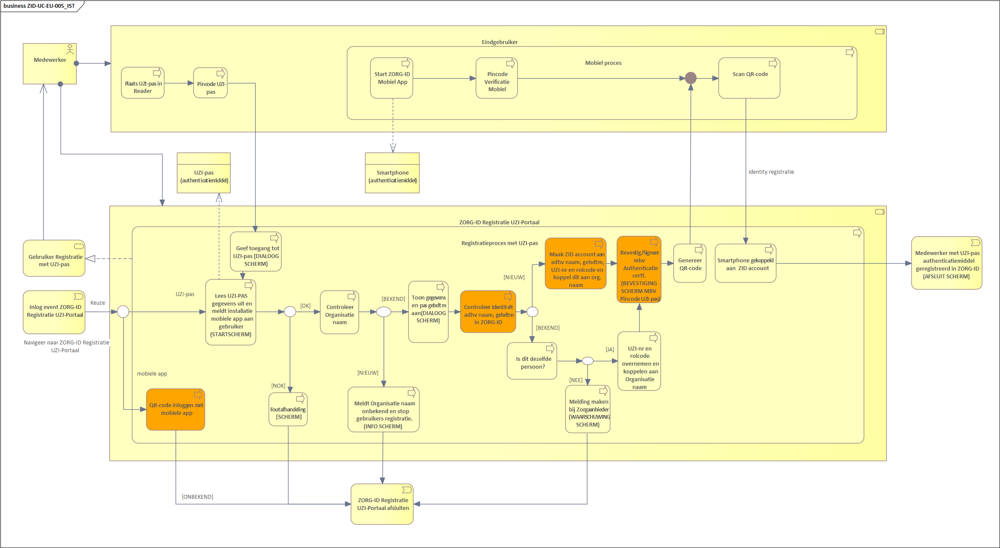

# ZID-UC-EU-005 Registreren met UZI-pas

<figure><figcaption></figcaption></figure>

## Step-up registratieproces met UZI-pas

### Pre-conditie

* Gebruiker heeft een “Zorgverlener” of “Medewerker op naam” UZI-pas type.
* Gebruiker heef ZORG-ID Mobile App geïnstalleerd op een smartphone (Android of iPhone) en een PIN code ingevoerd.
* URA en naam van zorgaanbieder is geregistreerd in ZORG-ID.

### Post-conditie

* De gebruiker kan zijn ZORG-ID Mobile App gebruiken om zich te authentiseren met zijn ZORG-ID identiteit bij die systemen die gebruik maken van ZORG-ID.
